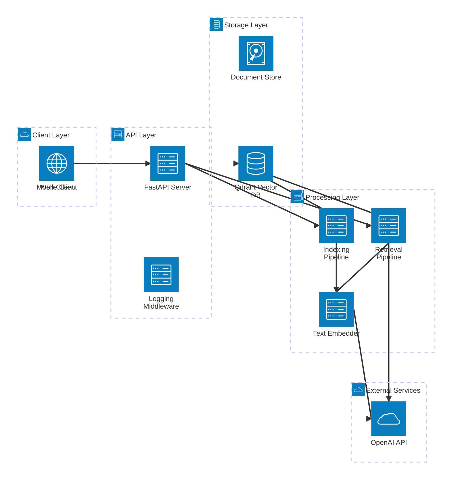

# Quilora AI System Architecture

## Overview

Quilora AI is a production-ready RAG (Retrieval-Augmented Generation) system built with FastAPI, Haystack 2.x, and Qdrant vector database.

## System Architecture



## Component Details

### Client Layer

- **Web Client**: Browser-based frontend (planned)
- **Mobile Client**: Mobile applications (planned)
- **API Clients**: Direct HTTP/REST integrations

### API Layer

- **FastAPI Server**: REST API with async support
  - Query endpoint (`/query`) - streaming and non-streaming
  - Document management endpoints (`/documents`, `/health`)
  - CORS middleware for cross-origin requests
- **Logging Middleware**: Request tracking and observability
  - Request ID generation
  - Performance timing
  - Structured logging

### Processing Layer

- **Retrieval Pipeline**: Query processing workflow

  1. Query embedding generation
  2. Vector similarity search
  3. LLM-based answer generation

  - Supports streaming and non-streaming modes
  - Automatic retry logic with exponential backoff
  - Performance timing at each stage

- **Indexing Pipeline**: Document ingestion workflow
  1. Document extraction (PDF, DOCX, TXT)
  2. Text chunking
  3. Embedding generation
  4. Vector storage
- **Text Embedder**: Cached embedding service
  - OpenAI text-embedding-3-small model
  - Connection pooling for efficiency

### Storage Layer

- **Qdrant Vector DB**: High-performance vector search
  - Cosine similarity search
  - Metadata filtering
  - Collection management
- **Document Store**: Original document storage
  - Full text preservation
  - Metadata association

### External Services

- **OpenAI API**: LLM and embedding provider
  - GPT-4o-mini for answer generation
  - text-embedding-3-small for vectors
  - Retry logic for transient failures
  - 60-second timeout for long requests

## Data Flow

### Query Flow (Streaming)

1. Client sends query to `/query?stream=true`
2. Middleware logs request and generates request ID
3. FastAPI routes to streaming handler
4. Retrieval pipeline:
   - Embeds query (with retry, ~50-200ms)
   - Searches Qdrant (with retry, ~20-100ms)
   - Streams LLM tokens via SSE (2-10s)
5. Client receives:
   - Documents event (with metadata)
   - Token events (incremental text)
   - Done event (with timing)

### Document Ingestion Flow

1. Client uploads document to `/documents/upload`
2. FastAPI validates and extracts content
3. Indexing pipeline:
   - Chunks text (if needed)
   - Generates embeddings (batch)
   - Stores vectors in Qdrant
   - Preserves original content
4. Returns document ID

## Deployment Architecture

### Docker Compose Setup

```
quilora-ai
├── api (FastAPI container)
│   ├── Port: 8000
│   ├── Health check: /health
│   └── Environment: .env
└── qdrant (Qdrant container)
    ├── Port: 6333
    ├── gRPC Port: 6334
    └── Volume: qdrant_storage
```

### Environment Configuration

- Development: `.env` with local settings
- Production: Environment variables via container orchestration
- Key settings:
  - `OPENAI_API_KEY`: Required
  - `QDRANT_URL`: Default http://localhost:6333
  - `FALLBACK_LLM_PROVIDER`: Default openai:gpt-4o-mini
  - `LOG_LEVEL`: Default INFO

## Observability

### Logging

- Structured JSON logs (production)
- Request correlation via X-Request-ID
- Performance timing for all operations
- Error tracking with stack traces

### Metrics (via /health)

- API uptime
- API version
- Qdrant connectivity status
- Request/response timing (in logs)

### Tracing

- Request ID propagation
- Pipeline stage timing:
  - embedding_ms
  - search_ms
  - generation_ms
  - total_ms

## Security Considerations

1. **API Keys**: Stored in environment variables, never in code
2. **CORS**: Configurable allowed origins
3. **Input Validation**: Pydantic models for all requests
4. **Error Handling**: Safe error messages, no internal details exposed
5. **Non-root User**: Docker containers run as `appuser`
6. **Timeouts**: 60s timeout for LLM requests prevents hanging

## Performance Characteristics

### Latency Targets

- Query embedding: < 200ms
- Vector search: < 100ms
- LLM generation (streaming): 2-10s first token
- Total query (non-streaming): 3-15s

### Throughput

- API: ~100 req/s (FastAPI async)
- Qdrant: 1000s of searches/s
- Bottleneck: OpenAI API rate limits

### Optimization Strategies

1. Connection pooling (embedder, document store)
2. Caching (embedder instance, document store connection)
3. Streaming (reduced perceived latency)
4. Retry with exponential backoff (reliability)
5. Async processing (FastAPI uvicorn workers)

## Future Enhancements (Phase 3+)

- [ ] Multi-LLM support via aisuite (OpenAI, Anthropic, etc.)
- [ ] Advanced document processing (tables, images)
- [ ] Hybrid search (dense + sparse vectors)
- [ ] User authentication and authorization
- [ ] Rate limiting per user
- [ ] Caching layer (Redis) for frequent queries
- [ ] Horizontal scaling (multiple API replicas)
- [ ] Load balancing
- [ ] Monitoring dashboard (Grafana)
- [ ] Distributed tracing (Jaeger, OpenTelemetry)
