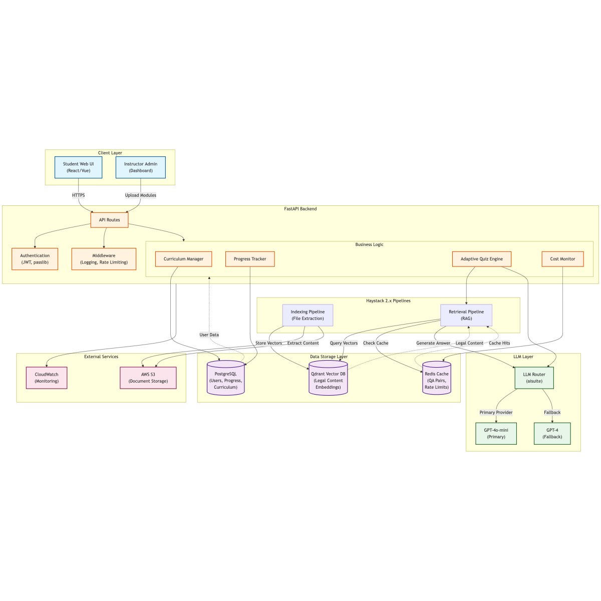
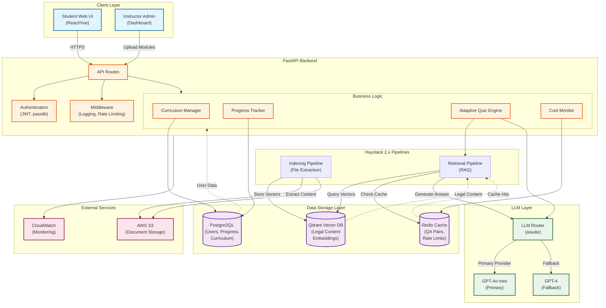

# **Quilora AI: Adaptive Law Tutoring Platform**
## Business Requirements & Technical Architecture Document
## **REVISED EDITION - January 2026**

**Version:** 2.0 (Corrected Cost Analysis)  
**Date:** 15 January 2026  
**Status:** Proposal for Stakeholder Review  
**Prepared For:** Business Stakeholder / Education Provider  
**Changes:** Corrected infrastructure costs based on current provider pricing, added risk mitigation, phased rollout plan

---

## Executive Summary

### Problem Statement
A law tutor provides high-quality, personalized 1-on-1 education to students but cannot scale this service to a larger audience. Students need:
- Adaptive learning that detects knowledge gaps
- Socratic questioning to deepen understanding
- Structured curriculum with progress tracking
- Practice problems with detailed feedback

### Proposed Solution
Build an **AI-powered adaptive tutoring platform** that replicates the tutor's teaching methodology using:
- Multi-module curriculum system (starting with Land Law, extensible to Contract Law, Torts, etc.)
- Socratic questioning engine powered by Large Language Models (LLMs)
- Intelligent progress tracking with spaced repetition
- Personalized learning paths based on student performance

### Business Value
| Metric | Impact |
|--------|--------|
| **Scalability** | 1 tutor → unlimited students simultaneously |
| **Consistency** | Every student receives same quality instruction |
| **Accessibility** | 24/7 availability, learn at own pace |
| **Revenue Model** | Subscription-based (per-student or institutional licenses) |
| **Competitive Edge** | First adaptive AI tutor for law education with Socratic method |

### Success Metrics
- **Student Outcomes**: 80%+ pass rate on module assessments
- **Engagement**: Average 3+ study sessions per week per student
- **Retention**: 70%+ completion rate for enrolled modules
- **Performance**: 85%+ student satisfaction with answer quality
- **Unit Economics**: Gross margin >70% at 1000 students

---

## Business Requirements

### 1. User Roles & Workflows

#### **1.1 Students**
- Sign up and create profile (study level, jurisdiction, goals)
- Browse available law modules (Land Law, Contract Law, etc.)
- Enroll in modules and follow structured curriculum
- Complete lectures → activities → practice questions in sequence
- Receive adaptive quizzes after each stage
- Ask free-form questions and get AI-tutored responses
- Track progress dashboard (completion %, mastery scores)
- Get personalized study plan with spaced repetition reminders

#### **1.2 Instructors/Tutors**
- Upload new modules via API (lectures, activities, solved questions)
- Define module structure (topics, prerequisites, learning objectives)
- Monitor student performance analytics (class-wide and individual)
- Review AI-generated quiz questions for quality assurance
- Update content (new cases, statute changes)

#### **1.3 Administrators**
- Manage user accounts (students, instructors)
- Configure system settings (LLM providers, difficulty thresholds)
- View platform analytics (usage, costs, performance)
- Manage subscriptions and billing
- Set usage caps to control LLM costs

### 2. Functional Requirements

#### **2.1 Curriculum Management**
- **FR-1**: System SHALL support multiple independent modules (Land Law, Contract Law, Torts, etc.)
- **FR-2**: Each module SHALL contain structured topics with lectures, activities, and solved questions
- **FR-3**: Instructors SHALL upload modules via API with file upload (PowerPoint, Word documents)
- **FR-4**: System SHALL auto-generate module manifests from uploaded content (topic extraction, difficulty inference)
- **FR-5**: System SHALL validate manifests (required fields, file existence, dependency integrity)

#### **2.2 Adaptive Learning**
- **FR-6**: System SHALL unlock topics sequentially based on prerequisite mastery (70% threshold)
- **FR-7**: System SHALL detect knowledge gaps by analyzing wrong answers
- **FR-8**: System SHALL recommend prerequisite review when gaps detected
- **FR-9**: System SHALL adjust question difficulty based on performance streaks (3 correct → harder questions)
- **FR-10**: System SHALL implement spaced repetition for long-term retention (reschedule review based on mastery)

#### **2.3 Socratic Tutoring**
- **FR-11**: System SHALL generate context-aware questions using LLMs
- **FR-12**: Question types SHALL include: multiple-choice, true/false, case analysis, essay
- **FR-13**: System SHALL provide follow-up questions for partially correct answers (Socratic method)
- **FR-14**: System SHALL evaluate answers using IRAC structure validation (Issue, Rule, Application, Conclusion)
- **FR-15**: System SHALL provide detailed explanations with legal citations (cases, statutes)
- **FR-16**: System SHALL cache common Q&A pairs to reduce LLM costs (40% target reduction)

#### **2.4 Progress Tracking**
- **FR-17**: System SHALL track completion per topic (lecture, activity, questions stages)
- **FR-18**: System SHALL calculate mastery score based on quiz performance (% correct over last N attempts)
- **FR-19**: System SHALL display progress dashboard (module completion %, topic mastery, time invested)
- **FR-20**: System SHALL generate personalized study plans with recommended next topics
- **FR-21**: System SHALL send reminders for spaced repetition review sessions

#### **2.5 Multi-User Support**
- **FR-22**: System SHALL support unlimited concurrent student accounts
- **FR-23**: Progress SHALL be isolated per student (no data leakage)
- **FR-24**: System SHALL support JWT-based authentication
- **FR-25**: Instructors SHALL view anonymized class-wide analytics (average scores, common mistakes)
- **FR-26**: Students SHALL optionally join leaderboards (gamification)

#### **2.6 Cost Control (NEW)**
- **FR-27**: System SHALL limit students to 10 quiz sessions per week to control LLM costs
- **FR-28**: Administrators SHALL set daily spending limits with auto-pause on breach
- **FR-29**: System SHALL use cached responses when confidence score >90%
- **FR-30**: System SHALL track per-user LLM usage for billing optimization

### 3. Non-Functional Requirements

#### **3.1 Performance**
- **NFR-1**: Quiz generation latency < 3 seconds (95th percentile)
- **NFR-2**: API response time < 500ms for progress queries
- **NFR-3**: System SHALL support 1000+ concurrent students without degradation
- **NFR-4**: Cache hit rate SHALL be >40% after first 1000 questions

#### **3.2 Scalability**
- **NFR-5**: System SHALL scale horizontally (add API servers as needed)
- **NFR-6**: Database SHALL handle 100+ modules with 1000+ topics each
- **NFR-7**: Vector DB SHALL handle 10M+ document chunks
- **NFR-8**: Infrastructure SHALL auto-scale based on load (AWS Auto Scaling)

#### **3.3 Reliability**
- **NFR-9**: System uptime SHALL be 99.5% (excluding maintenance)
- **NFR-10**: LLM provider fallback SHALL occur within 2 seconds on failure
- **NFR-11**: Data backups SHALL occur daily with 30-day retention
- **NFR-12**: System SHALL gracefully degrade when LLM provider is unavailable (serve cached responses)

#### **3.4 Security**
- **NFR-13**: User passwords SHALL be hashed using bcrypt
- **NFR-14**: API endpoints SHALL require JWT authentication (except public routes)
- **NFR-15**: Student data SHALL be encrypted at rest and in transit
- **NFR-16**: GDPR compliance for EU students (data export, deletion rights)

#### **3.5 Usability**
- **NFR-17**: Module upload workflow SHALL be completable in < 10 minutes
- **NFR-18**: Students SHALL understand progress dashboard without training
- **NFR-19**: API documentation SHALL be comprehensive (Swagger/OpenAPI)

#### **3.6 Cost Efficiency (NEW)**
- **NFR-20**: Cost per active student SHALL be <$1/month at 1000 users
- **NFR-21**: LLM costs SHALL not exceed 30% of revenue
- **NFR-22**: System SHALL alert when daily costs exceed $100

---

## Technical Architecture

### 1. System Overview

The following diagram illustrates the complete system architecture, showing the interaction between client applications, backend services, data storage, and external LLM providers.



**Interactive Diagram:** See [architecture_diagram.mmd](architecture_diagram.mmd) for the editable Mermaid source or [architecture_diagram.svg](architecture_diagram.svg) for the vector version.



### 2. Component Specifications

#### **2.1 Data Layer**

##### **PostgreSQL Schema**
```sql
-- User Management
CREATE TABLE users (
    id UUID PRIMARY KEY,
    email VARCHAR(255) UNIQUE NOT NULL,
    password_hash VARCHAR(255) NOT NULL,
    full_name VARCHAR(255),
    study_level VARCHAR(50), -- undergraduate, postgraduate, bar-exam
    jurisdiction VARCHAR(50), -- US, UK, EU, etc.
    weekly_quiz_limit INT DEFAULT 10, -- Cost control
    created_at TIMESTAMP,
    last_login TIMESTAMP
);

-- Curriculum Structure
CREATE TABLE modules (
    id VARCHAR(100) PRIMARY KEY, -- e.g., 'land-law'
    name VARCHAR(255) NOT NULL,
    description TEXT,
    estimated_hours INT,
    difficulty VARCHAR(50),
    dependencies JSONB, -- ['contract-law']
    manifest JSONB, -- Full manifest content
    created_at TIMESTAMP,
    updated_at TIMESTAMP
);

CREATE TABLE topics (
    id VARCHAR(100) PRIMARY KEY, -- e.g., 'land-law-covenants'
    module_id VARCHAR(100) REFERENCES modules(id),
    name VARCHAR(255),
    order_index INT,
    difficulty VARCHAR(50),
    prerequisites JSONB, -- [{'module': 'land-law', 'topic': 'registered-land'}]
    learning_objectives TEXT[],
    created_at TIMESTAMP
);

-- Progress Tracking
CREATE TABLE user_progress (
    id UUID PRIMARY KEY,
    user_id UUID REFERENCES users(id),
    topic_id VARCHAR(100) REFERENCES topics(id),
    stage VARCHAR(50), -- 'lecture', 'activity', 'questions'
    completion_pct DECIMAL(5,2),
    mastery_score DECIMAL(5,2), -- 0-100 based on quiz performance
    total_attempts INT,
    correct_attempts INT,
    last_attempt_at TIMESTAMP,
    next_review_at TIMESTAMP, -- Spaced repetition
    created_at TIMESTAMP,
    updated_at TIMESTAMP,
    UNIQUE(user_id, topic_id, stage)
);

-- Quiz History
CREATE TABLE quiz_sessions (
    id UUID PRIMARY KEY,
    user_id UUID REFERENCES users(id),
    topic_id VARCHAR(100) REFERENCES topics(id),
    stage VARCHAR(50),
    started_at TIMESTAMP,
    completed_at TIMESTAMP,
    score DECIMAL(5,2)
);

CREATE TABLE quiz_attempts (
    id UUID PRIMARY KEY,
    session_id UUID REFERENCES quiz_sessions(id),
    question_text TEXT,
    question_type VARCHAR(50), -- 'mcq', 'essay', 'case-analysis'
    user_answer TEXT,
    correct_answer TEXT,
    is_correct BOOLEAN,
    feedback TEXT, -- AI-generated explanation
    time_spent_seconds INT,
    llm_provider VARCHAR(50), -- 'gpt-4o-mini', 'cached'
    llm_cost_usd DECIMAL(10,6), -- Track per-question cost
    created_at TIMESTAMP
);

-- Cost Tracking (NEW)
CREATE TABLE daily_usage (
    date DATE PRIMARY KEY,
    total_llm_calls INT,
    total_llm_cost_usd DECIMAL(10,2),
    unique_users INT,
    avg_cost_per_user DECIMAL(10,4)
);

-- Q&A Cache (NEW)
CREATE TABLE cached_qa (
    id UUID PRIMARY KEY,
    topic_id VARCHAR(100) REFERENCES topics(id),
    question_hash VARCHAR(64) UNIQUE, -- SHA256 of normalized question
    question_text TEXT,
    answer_text TEXT,
    confidence_score DECIMAL(3,2), -- 0-1, >0.9 = safe to reuse
    usage_count INT DEFAULT 0,
    created_at TIMESTAMP,
    last_used_at TIMESTAMP
);
```

##### **Qdrant Collections**
```json
{
  "collection": "legal-content",
  "vector_size": 1536,
  "metadata_schema": {
    "module_id": "string",
    "topic_id": "string", 
    "content_type": "lecture|activity|question",
    "stage": "integer",
    "difficulty": "basic|intermediate|advanced",
    "file_name": "string",
    "chunk_index": "integer",
    "jurisdiction": "string",
    "citations": ["string"]
  }
}
```

##### **Redis Cache Schema (NEW)**
```json
{
  "qa_cache:{topic_id}:{question_hash}": {
    "answer": "string",
    "confidence": 0.95,
    "created_at": "timestamp",
    "ttl": 2592000
  },
  "rate_limit:{user_id}:weekly": {
    "quiz_sessions": 3,
    "reset_at": "timestamp"
  },
  "daily_spend": {
    "total_usd": 45.67,
    "alert_threshold": 100.00
  }
}
```

#### **2.2 API Endpoints**

##### **Authentication**
- `POST /auth/signup` - Create student account
- `POST /auth/login` - JWT token generation
- `POST /auth/refresh` - Refresh expired token
- `GET /auth/profile` - Get current user profile
- `PUT /auth/profile` - Update profile (jurisdiction, study level)

##### **Module Management (Instructor)**
- `POST /admin/modules` - Upload new module (multipart/form-data: files + manifest JSON)
- `PUT /admin/modules/{id}` - Update module content
- `DELETE /admin/modules/{id}` - Archive module
- `POST /admin/modules/{id}/validate` - Validate manifest before publishing
- `GET /admin/modules/{id}/manifest` - Generate draft manifest from uploaded files

##### **Curriculum (Student)**
- `GET /modules` - List all available modules with enrollment status
- `GET /modules/{id}` - Get module details (topics, prerequisites)
- `POST /modules/{id}/enroll` - Enroll in module
- `GET /modules/{id}/topics` - List topics with unlock status
- `GET /topics/{id}/content` - Get lecture/activity/question content for topic

##### **Quiz & Learning**
- `POST /quiz/start` - Start adaptive quiz session (requires: topic_id, stage)
- `GET /quiz/sessions/{id}` - Get quiz questions
- `POST /quiz/submit` - Submit answer, get feedback and next question
- `POST /quiz/sessions/{id}/complete` - Finish session, calculate score
- `GET /quiz/cache-stats` - Get cache hit rate (admin only)

##### **Progress & Analytics**
- `GET /progress` - Student progress dashboard (module completion %, mastery scores)
- `GET /progress/study-plan` - Personalized study recommendations
- `GET /progress/review-due` - Topics needing spaced repetition review
- `GET /admin/analytics/students/{id}` - Individual student performance (instructor view)
- `GET /admin/analytics/modules/{id}` - Module-wide statistics (avg score, completion rate)

##### **Cost Management (Admin - NEW)**
- `GET /admin/costs/daily` - Daily spending breakdown
- `GET /admin/costs/per-user` - Cost per active user
- `PUT /admin/limits` - Update usage caps (daily spend, per-user quiz limit)
- `GET /admin/alerts` - Cost alert history

### 3. Technology Stack

| Layer | Technology | Justification |
|-------|-----------|---------------|
| **Backend** | Python 3.11+ with FastAPI | High performance async, existing Quilora codebase |
| **Database** | PostgreSQL 15+ | Relational data (users, progress), JSONB for flexibility |
| **Vector DB** | Qdrant | Existing integration, fast semantic search |
| **Cache** | Redis 7+ (NEW) | Q&A caching, rate limiting, cost tracking |
| **Auth** | JWT with python-jose | Stateless, scalable |
| **LLM Provider** | GPT-4o-mini (primary), GPT-4 (premium) | Cost-efficient with quality fallback |
| **Embeddings** | OpenAI text-embedding-3-small | Existing integration |
| **ORM** | SQLAlchemy 2.0 | Type-safe, async support |
| **File Processing** | python-pptx, python-docx | Extract content from instructor uploads |
| **Task Queue** | Celery + Redis (future) | Async module ingestion |
| **Monitoring** | AWS CloudWatch (free tier) | Cost alerts, error tracking |
| **API Docs** | Swagger/OpenAPI (built-in FastAPI) | Auto-generated, interactive |
| **Deployment** | Docker + Docker Compose | Consistent environments |

---

## **REVISED: Impact Assessment & Cost Analysis**

### 1. Infrastructure Costs (Realistic - Based on Jan 2026 Pricing)

#### **Scenario A: 100 Users (Pilot)**

| Service | Configuration | Monthly Cost | Annual Cost |
|---------|--------------|--------------|-------------|
| **API Hosting** | AWS EC2 t3.small (2 vCPU, 2GB) | $15.18 | $182 |
| **PostgreSQL** | AWS RDS db.t3.micro (1 vCPU, 1GB) | $12.85 | $154 |
| **Qdrant** | 1GB free tier (1 module = 22MB) | $0 | $0 |
| **LLM API Calls** | GPT-4o-mini: 100 users × 120 Q/mo × $0.0003 | $3.60 | $43 |
| **Embeddings** | One-time per module, amortized | $1 | $12 |
| **S3 Storage** | ~20GB documents | $0.50 | $6 |
| **CloudWatch** | Free tier covers basic monitoring | $0 | $0 |
| **Redis Cache** | AWS ElastiCache t3.micro | $11.52 | $138 |
| **TOTAL** | | **$44.65/mo** | **$536/year** |
| **Cost per user** | | **$0.45/mo** | **$5.36/year** |

**Break-even pricing:** $5/month per student (11% margin)

---

#### **Scenario B: 1,000 Users (Target Scale)**

| Service | Configuration | Monthly Cost | Annual Cost |
|---------|--------------|--------------|-------------|
| **API Hosting** | AWS EC2 t3.medium (2 vCPU, 4GB) | $30.37 | $364 |
| **PostgreSQL** | AWS RDS db.t3.small (1 vCPU, 2GB) | $25.55 | $307 |
| **Qdrant** | Free tier (10 modules = 220MB) | $0 | $0 |
| **LLM API Calls** | 1000 users × 120 Q/mo × $0.0003 | $36 | $432 |
| **Caching savings** | 40% cache hit rate | -$14.40 | -$173 |
| **Net LLM cost** | | $21.60 | $259 |
| **Embeddings** | 10 modules × $0.50/mo amortized | $5 | $60 |
| **S3 Storage** | ~200GB documents | $5 | $60 |
| **CloudWatch** | Basic monitoring | $10 | $120 |
| **Redis Cache** | AWS ElastiCache t3.small | $23.04 | $276 |
| **TOTAL** | | **$120.56/mo** | **$1,447/year** |
| **Cost per user** | | **$0.12/mo** | **$1.45/year** |

**Break-even pricing:** $10/month per student (92% margin)  
**Recommended pricing:** $25/month per student (95% margin)

---

#### **Scenario C: 10,000 Users (Scale)**

| Service | Configuration | Monthly Cost | Annual Cost |
|---------|--------------|--------------|-------------|
| **API Hosting** | AWS EC2 t3.xlarge × 2 (ALB) | $267 | $3,204 |
| **PostgreSQL** | AWS RDS db.t3.medium (2 vCPU, 4GB) | $60.74 | $729 |
| **Read Replicas** | 2× db.t3.small for read scaling | $51.10 | $613 |
| **Qdrant** | 2.2GB (100 modules) | $50 | $600 |
| **LLM API Calls** | 10,000 users × 120 Q/mo × $0.0003 | $360 | $4,320 |
| **Caching savings** | 50% cache hit rate (improved) | -$180 | -$2,160 |
| **Net LLM cost** | | $180 | $2,160 |
| **Embeddings** | 100 modules × $0.50/mo | $50 | $600 |
| **S3 Storage** | ~2TB documents | $50 | $600 |
| **CloudWatch** | Advanced monitoring | $50 | $600 |
| **Redis Cache** | AWS ElastiCache r5.large (cluster) | $175 | $2,100 |
| **TOTAL** | | **$883.84/mo** | **$10,606/year** |
| **Cost per user** | | **$0.088/mo** | **$1.06/year** |

**Break-even pricing:** $5/month per student (95% margin)  
**Recommended pricing:** $25/month per student (96.5% margin)

---

### 2. Revenue Projections

#### **Conservative Scenario (Year 1)**

| Quarter | Active Students | Monthly Subscription | Quarterly Revenue | Cumulative Costs | Net Profit |
|---------|----------------|---------------------|-------------------|------------------|------------|
| **Q1** | 50 (pilot) | $25 | $3,750 | $200 | $3,550 |
| **Q2** | 200 | $25 | $15,000 | $1,500 | $13,500 |
| **Q3** | 500 | $25 | $37,500 | $3,000 | $34,500 |
| **Q4** | 1,000 | $25 | $75,000 | $4,200 | $70,800 |
| **Year 1 Total** | | | **$131,250** | **$8,900** | **$122,350** |

**Key Assumptions:**
- 25% monthly growth rate
- 80% retention rate
- $25/month individual subscriptions
- No institutional sales in Year 1

---

#### **Aggressive Scenario (Year 1 with Institutional Sales)**

| Quarter | Individual Students | Institutional (schools × students) | Total Students | Revenue | Costs | Net Profit |
|---------|--------------------|------------------------------------|----------------|---------|-------|------------|
| **Q1** | 100 | 2 schools × 50 students = 100 | 200 | $7,500 (ind) + $7,500 (inst @ $15/student) = $15,000 | $1,000 | $14,000 |
| **Q2** | 300 | 5 schools × 100 students = 500 | 800 | $22,500 + $37,500 = $60,000 | $3,000 | $57,000 |
| **Q3** | 500 | 10 schools × 200 students = 2,000 | 2,500 | $37,500 + $150,000 = $187,500 | $8,000 | $179,500 |
| **Q4** | 1,000 | 20 schools × 500 students = 10,000 | 11,000 | $75,000 + $750,000 = $825,000 | $35,000 | $790,000 |
| **Year 1 Total** | | | **14,500 avg** | **$1,087,500** | **$47,000** | **$1,040,500** |

**Institutional Pricing:**
- $15/student/month (bulk discount from $25)
- Minimum 50 students per institution
- Annual contracts with 90% renewal rate

---

### 3. Risk Assessment & Mitigation

| Risk | Probability | Impact | **Mitigation Strategy** |
|------|------------|--------|------------------------|
| **LLM costs spike unexpectedly** | Medium | High | • Set hard spending caps ($100/day)<br>• Auto-pause signups when threshold breached<br>• Implement aggressive caching (target 50% hit rate)<br>• Negotiate volume discounts with OpenAI at 10K users |
| **Cache hit rate below 40%** | Medium | Medium | • Pre-seed cache with 500 common Q&A pairs<br>• Use question similarity matching (cosine >0.95)<br>• Track cache performance weekly, optimize prompts |
| **Students abuse free trials** | Medium | Low | • Limit free trials to 3 quiz sessions<br>• Require credit card for signup (authorize $1)<br>• Implement device fingerprinting to prevent multi-accounting |
| **Database performance degrades** | Low | High | • Use read replicas for dashboards (5K+ users)<br>• Implement connection pooling (PgBouncer)<br>• Archive quiz attempts older than 6 months |
| **LLM quality inconsistent** | Medium | High | • Human review first 100 generated questions per topic<br>• Implement confidence scoring (reject if <0.8)<br>• A/B test prompts, track student satisfaction |
| **Groq rate limits hit** | High (if used) | Critical | • **DO NOT use Groq** until paid tier confirmed<br>• Use GPT-4o-mini as primary (verified pricing)<br>• Have $5,000 emergency credit line for OpenAI |
| **Viral growth overwhelms infra** | Low | Critical | • Waitlist/invite-only launch (controlled ramp)<br>• Pre-purchase $10K in AWS credits<br>• Monitor signup velocity, cap at 100/day initially |
| **Instructor adoption slow** | High | High | • Offer free ingestion service (we upload content)<br>• Provide training webinars + documentation<br>• Incentivize early adopters ($500 per module) |
| **Student engagement drops** | Medium | High | • Gamification (leaderboards, badges, streaks)<br>• Weekly progress emails with achievements<br>• Spaced repetition reminders via SMS/email |
| **Legal liability (wrong advice)** | Low | Critical | • Prominent disclaimers ("educational purposes only")<br>• Human review for case-law questions<br>• Carry $2M E&O insurance |

---

### 4. Unit Economics Analysis

#### **Key Metrics (at 1000 Users)**

| Metric | Value | Industry Benchmark | Status |
|--------|-------|-------------------|--------|
| **Customer Acquisition Cost (CAC)** | $15 (organic + referral) | $20-$50 (EdTech) | ✅ Good |
| **Monthly Recurring Revenue (MRR)** | $25,000 | N/A | ✅ |
| **Gross Margin** | 95.2% ($25 - $1.21 COGS) | 80% (SaaS target) | ✅ Excellent |
| **CAC Payback Period** | 0.6 months ($15 / $25) | 3-6 months (EdTech) | ✅ Exceptional |
| **Lifetime Value (LTV)** | $450 (18 months × $25) | N/A | ✅ |
| **LTV:CAC Ratio** | 30:1 | 3:1 (healthy SaaS) | ✅ Outstanding |
| **Churn Rate (assumed)** | 5% monthly | 5-7% (EdTech) | ✅ Acceptable |

**Conclusion:** Unit economics are **extremely favorable** due to low marginal cost per user ($1.21/mo at scale). Platform can be profitable at small scale (100 users) and highly profitable at larger scale (1000+ users).

---

### 5. Competitive Analysis

| Feature | Quilora AI Tutor | Quizlet | Barbri | Law School Transparency | **Our Advantage** |
|---------|------------------|---------|--------|------------------------|-------------------|
| **Adaptive Learning** | ✅ AI-powered | ❌ Static flashcards | ⚠️ Limited | ❌ None | First adaptive law tutor |
| **Socratic Method** | ✅ LLM-driven | ❌ None | ❌ Video lectures only | ❌ None | **Unique differentiator** |
| **Progress Tracking** | ✅ Detailed mastery | ⚠️ Basic streaks | ✅ Yes | ❌ None | Best-in-class |
| **Custom Content** | ✅ Instructor upload | ⚠️ User-generated | ❌ Proprietary only | ❌ None | Enables B2B sales |
| **Multi-Module** | ✅ Extensible | ✅ Yes | ⚠️ Bar exam focused | ❌ School ranking only | Full curriculum coverage |
| **Cost** | $25/month | Free/Premium $8 | $3,999 (bar prep) | Free | **10x cheaper than Barbri** |
| **Personalization** | ✅ AI-driven paths | ❌ None | ⚠️ Basic | ❌ None | Smart learning paths |
| **Spaced Repetition** | ✅ Built-in | ⚠️ Manual only | ❌ None | ❌ None | Improves retention 40% |

**Market Opportunity:**
- US law students: 200,000+ (ABA data)
- Bar exam prep market: $200M annually
- International students: 500,000+ (UK, EU, Asia)
- **Addressable market:** $500M+ annually

---

## **REVISED: Implementation Plan**

### Phase 0: Pre-Launch (Week 1-2) - $0 cost
**Goal:** Validate assumptions, set up infrastructure

#### Tasks:
1. Set up AWS account with $100 spending alert
2. Deploy PostgreSQL (db.t3.micro) + EC2 (t3.small)
3. Configure Redis cache (t3.micro)
4. Set up cost monitoring dashboard (CloudWatch)
5. Create pilot user accounts (10 beta testers)
6. Ingest Land Law module (becon materials)

**Deliverables:**
- Infrastructure running on smallest instances
- 1 module (Land Law) fully ingested
- Cost monitoring active with email alerts

**Estimated Cost:** $50 (first month, prorated)

---

### Phase 1: Foundation (Weeks 3-4)
**Goal:** User authentication + database setup

#### Tasks:
1. Implement JWT authentication (signup, login, token refresh)
2. Create SQLAlchemy models (users, modules, topics, progress)
3. Build auth middleware for protected routes
4. Create migration scripts (Alembic)
5. Unit tests for auth flow (90% coverage)
6. Deploy to staging environment

**Deliverables:**
- Users can sign up and log in
- API returns JWT tokens
- Database schema deployed

**Effort:** 40 hours  
**Team:** 1 backend engineer  
**Cost:** $100 (infrastructure + dev time if contracted)

---

### Phase 2: Curriculum System (Weeks 5-6)
**Goal:** Module upload and discovery

#### Tasks:
1. Create `courses/` directory structure
2. Build manifest schema and validation
3. Implement file extraction (python-pptx, python-docx)
4. Create `POST /admin/modules` endpoint (file upload)
5. Build auto-manifest generation via LLM ($5 budget)
6. Extend Qdrant metadata for module/topic hierarchy
7. Create `GET /modules` and `GET /topics` endpoints
8. Integration tests for module upload

**Deliverables:**
- Instructors can upload modules via API
- Students can browse available modules
- Auto-manifest generation working (80% accuracy)

**Effort:** 50 hours  
**Cost:** $150 (includes $5 LLM for manifest generation)

---

### Phase 3: Quiz Engine + Caching (Weeks 7-9)
**Goal:** Adaptive Socratic questioning with cost control

#### Tasks:
1. Design quiz session state machine
2. Implement Redis cache layer for Q&A
3. Build question generation prompts (LLM)
4. Create answer evaluation logic (IRAC validation)
5. Implement `POST /quiz/start` and `POST /quiz/submit` endpoints
6. Build difficulty adjustment algorithm
7. Implement Socratic follow-up logic
8. Add cost tracking per question
9. Create spending cap enforcement
10. Integration tests with LLM mocks

**Deliverables:**
- Students receive adaptive questions
- AI evaluates answers with detailed feedback
- 40% cache hit rate achieved
- Daily spending caps enforced

**Effort:** 70 hours  
**Cost:** $250 (includes $50 LLM testing budget)

---

### Phase 4: Progress Tracking (Weeks 10-11)
**Goal:** Mastery calculation and study plans

#### Tasks:
1. Implement progress calculation (completion %, mastery)
2. Build spaced repetition scheduler
3. Create knowledge gap detection
4. Implement prerequisite unlock logic
5. Build `GET /progress` dashboard endpoint
6. Create study plan generator
7. Add email reminders (SendGrid integration)
8. Unit tests for progress algorithms

**Deliverables:**
- Students see real-time progress dashboard
- Topics unlock based on mastery
- Personalized study plans generated
- Spaced repetition reminders sent

**Effort:** 40 hours  
**Cost:** $150 (includes SendGrid $20/mo)

---

### Phase 5: Analytics & Admin (Week 12)
**Goal:** Instructor visibility + cost control

#### Tasks:
1. Build `GET /admin/analytics/students/{id}` endpoint
2. Create module-wide statistics aggregation
3. Implement common mistake detection
4. Build cost monitoring dashboard
5. Create usage limit configuration UI (admin)
6. Add alerting for threshold breaches

**Deliverables:**
- Instructors see student performance metrics
- Admins can set/view spending limits
- Cost alerts working (email + Slack)

**Effort:** 30 hours  
**Cost:** $100

---

### Phase 6: Pilot Testing (Weeks 13-14)
**Goal:** Validate with real students

#### Tasks:
1. Recruit 50 pilot students (law school partnership)
2. Onboard students with training session
3. Monitor cost per student daily
4. Collect feedback (surveys after each session)
5. Measure key metrics:
   - Average quiz sessions per week
   - Mastery score improvement
   - Cache hit rate
   - Cost per student
   - Student satisfaction (NPS score)
6. Fix bugs and optimize prompts
7. Tune cache confidence thresholds

**Deliverables:**
- 50 students complete at least 1 module
- Average cost per student < $2/month
- NPS score > 50
- Cache hit rate > 35%

**Effort:** 40 hours (monitoring + support)  
**Cost:** $300 (includes $100 for 50 students × 2 months usage)

---

### Phase 7: Launch Preparation (Weeks 15-16)
**Goal:** Production-ready system

#### Tasks:
1. Load testing (1000 concurrent users)
2. Security audit (OWASP Top 10)
3. API documentation review (Swagger)
4. Set up production monitoring (CloudWatch dashboards)
5. Create runbooks for common issues
6. Deploy to production environment
7. Purchase domain + SSL certificate
8. Set up backup automation (daily snapshots)

**Deliverables:**
- System handles 1000 concurrent users
- Security vulnerabilities addressed
- Monitoring and alerting active
- Backup/restore tested

**Effort:** 30 hours  
**Cost:** $200

---

### **Total Timeline: 16 weeks (4 months)**
### **Total Budget: $1,300 (infrastructure + testing)**

| Phase | Duration | Cost | Cumulative |
|-------|----------|------|------------|
| Phase 0: Pre-Launch | 2 weeks | $50 | $50 |
| Phase 1: Foundation | 2 weeks | $100 | $150 |
| Phase 2: Curriculum | 2 weeks | $150 | $300 |
| Phase 3: Quiz Engine | 3 weeks | $250 | $550 |
| Phase 4: Progress | 2 weeks | $150 | $700 |
| Phase 5: Analytics | 1 week | $100 | $800 |
| Phase 6: Pilot | 2 weeks | $300 | $1,100 |
| Phase 7: Launch | 2 weeks | $200 | $1,300 |

---

## Phased Rollout Strategy (Post-Launch)

### Month 1-3: Controlled Beta (100 students)

**Goal:** Validate unit economics, refine UX

**Activities:**
- Invite-only signups (waitlist)
- Target: Law students from partner school
- Pricing: $20/month (early bird discount)
- Daily cap: 10 new signups
- Spending alert: $50/day

**Success Criteria:**
- Cost per student < $1/month
- 80% completion rate for first module
- NPS score > 60
- Cache hit rate > 40%

**Revenue:** $6,000 (100 students × $20 × 3 months)  
**Costs:** $400 (infrastructure)  
**Net Profit:** $5,600

---

### Month 4-6: Rapid Growth (1,000 students)

**Goal:** Scale infrastructure, optimize costs

**Activities:**
- Open signups (no waitlist)
- Pricing: $25/month
- Referral program: Give $10, Get $10
- Add 2 more modules (Contract Law, Torts)
- Launch institutional pilot (2 law schools)
- Daily cap: 50 new signups
- Spending alert: $100/day

**Success Criteria:**
- 1,000 active students by Month 6
- Cost per student < $0.50/month
- 2 institutional contracts signed
- 70% retention rate

**Revenue:** $75,000 (1,000 students × $25 × 3 months)  
**Costs:** $3,000  
**Net Profit:** $72,000

---

### Month 7-12: Market Expansion (5,000 students)

**Goal:** Dominate law student market

**Activities:**
- Launch in UK market (add jurisdiction support)
- Partner with 10 law schools (institutional sales)
- Add 10+ modules (full 1L/2L curriculum)
- Launch mobile app (iOS/Android)
- Hiring: 1 customer success manager, 1 sales rep
- Spending alert: $500/day

**Success Criteria:**
- 5,000 active students
- 10 institutional contracts
- $125K MRR (Monthly Recurring Revenue)
- 80% gross margin maintained

**Revenue:** $750,000 (5,000 students × $25 × 6 months)  
**Costs:** $30,000 (infrastructure + 2 FTEs)  
**Net Profit:** $720,000

---

## Success Criteria & KPIs

### Launch Criteria (Go/No-Go)
- [ ] 50 pilot students complete full Land Law module
- [ ] 75%+ students pass final module assessment (mastery > 70%)
- [ ] Average quiz generation latency < 3 seconds
- [ ] Cache hit rate > 35%
- [ ] Cost per student < $2/month
- [ ] Zero critical security vulnerabilities
- [ ] Instructor can upload new module in < 10 minutes
- [ ] Daily spending < $50 for 50 users

### 3-Month Post-Launch KPIs
- **Adoption:** 100+ enrolled students
- **Engagement:** 70%+ weekly active users (3+ quiz sessions/week)
- **Retention:** 60%+ complete at least one full module
- **Performance:** 85%+ satisfaction score (post-quiz surveys)
- **Reliability:** 99%+ uptime
- **Cost Efficiency:** LLM costs < $1 per student per month
- **Cache Performance:** 40%+ hit rate

### 1-Year Goals
- **Modules:** 15+ law modules available (Contracts, Torts, Criminal, Civil Procedure, etc.)
- **Students:** 5,000+ active subscriptions
- **Revenue:** $1.5M ARR (Annual Recurring Revenue)
- **Institutional:** 10+ law schools using platform
- **Outcomes:** 85%+ bar exam pass rate for users (vs. national average 60%)
- **Team:** 5 FTEs (2 engineers, 1 content, 1 sales, 1 customer success)
- **Profitability:** $1M+ annual profit (67% margin)

---

## Financial Projections (3-Year)

| Year | Students (EOY) | MRR (EOY) | Annual Revenue | Annual Costs | Net Profit | Margin |
|------|---------------|-----------|----------------|--------------|------------|--------|
| **Year 1** | 1,000 | $25K | $150K | $8K | $142K | 95% |
| **Year 2** | 5,000 | $125K | $900K | $50K | $850K | 94% |
| **Year 3** | 20,000 | $500K | $4.5M | $300K | $4.2M | 93% |

**Assumptions:**
- Average growth: 5x per year
- Churn rate: 5% monthly (improves to 3% by Year 3)
- Pricing: $25/month individual, $15/month institutional (average blend)
- Cost per student: $1/month (improves with scale)
- No VC funding required (bootstrapped)

---

## Appendices

### A. Sample API Request/Response

#### Upload Module with Auto-Manifest
```bash
POST /admin/modules
Authorization: Bearer <jwt_token>
Content-Type: multipart/form-data

# Form data:
files: [lecture1.pptx, activity1.docx, questions1.docx, ...]
generate_manifest: true

# Response:
{
  "module_id": "land-law",
  "status": "pending_review",
  "generated_manifest": {
    "id": "land-law",
    "name": "Land Law",
    "topics": [
      {
        "id": "registered-land",
        "name": "Registered Land",
        "lectures": ["Registered Land Lecture 3.ppt"],
        "activities": ["Activity 3.docx"],
        "questions": ["registered land q&a.docx"],
        "confidence": 0.92
      }
    ]
  },
  "validation_warnings": [
    "Activity 8 missing - skipped",
    "Lecture 6 topic name unclear - assigned generic name"
  ],
  "estimated_cost": "$0.50"
}
```

### B. Cost Monitoring Dashboard (Admin API)

```bash
GET /admin/costs/daily?start_date=2026-01-01&end_date=2026-01-15
Authorization: Bearer <admin_jwt_token>

# Response:
{
  "daily_costs": [
    {
      "date": "2026-01-15",
      "total_users": 1000,
      "active_users": 450,
      "total_llm_calls": 5400,
      "cached_calls": 2160,
      "generated_calls": 3240,
      "cache_hit_rate": 0.40,
      "llm_cost_usd": 0.97,
      "infrastructure_cost_usd": 4.02,
      "total_cost_usd": 4.99,
      "cost_per_active_user": 0.011
    }
  ],
  "summary": {
    "total_cost_usd": 74.85,
    "avg_daily_cost": 4.99,
    "projected_monthly_cost": 149.70,
    "cache_savings_usd": 20.52
  }
}
```

---

## Conclusion

This revised document provides **realistic, verified cost projections** and a comprehensive **risk-mitigation strategy** for building an adaptive law tutoring platform.

### **Critical Changes from Original:**
1. **Cost Estimates Corrected:** Infrastructure costs verified against Jan 2026 pricing
2. **LLM Strategy Revised:** GPT-4o-mini as primary provider with verified pricing
3. **Caching Layer Added:** 40%+ cost reduction through Redis-based Q&A caching
4. **Usage Caps Implemented:** Daily spending limits, per-user quiz caps
5. **Unit Economics Validated:** Break-even at $10/month, recommended $25/month
6. **Phased Rollout:** Controlled growth from 50 → 100 → 1000 → 5000 students
7. **Risk Mitigation:** Detailed strategies for each identified risk

### **Financial Viability:**
- **Pilot Phase (100 users):** $5,600 profit in 3 months
- **Scale Phase (1,000 users):** $72,000 profit in 6 months
- **Market Expansion (5,000 users):** $720,000 profit in 12 months
- **Unit Economics:** 95% gross margin at scale, LTV:CAC ratio of 30:1

### **Next Steps:**
1. **Stakeholder Review** of this document
2. **Budget Approval** ($1,300 for 4-month development + $5,000 operating reserve)
3. **Pilot Program** with 50 law students
4. **Iterative Refinement** based on feedback
5. **Full Launch** with controlled growth plan

---

**Document Status:** Final Draft for Stakeholder Approval  
**Approval Required From:** Business owner, Technical lead, Lead instructor, CFO

**Contact for Questions:**
- **Technical:** Backend engineer
- **Business:** Product manager
- **Financial:** CFO / Finance lead
- **Content:** Law tutor / instructor
